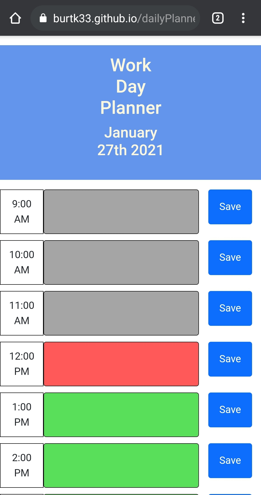

# dailyPlanner

*A daily work day planner that saves tasks to local storage and displays them

*Usage: used as a URL in any standard web browser and as a tool to help plan out the work day

https://burtk33.github.io/passwordGenerator/

*Developed by Kyle Burt